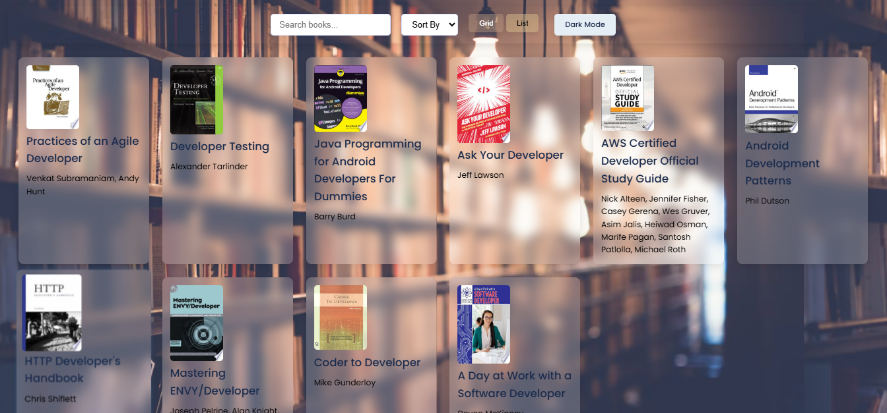
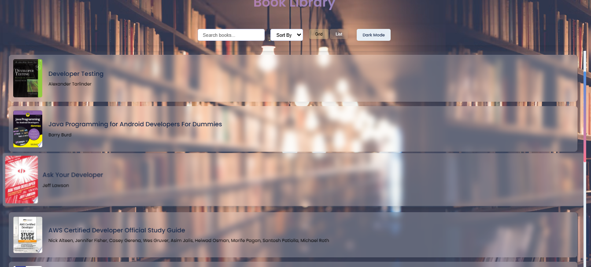
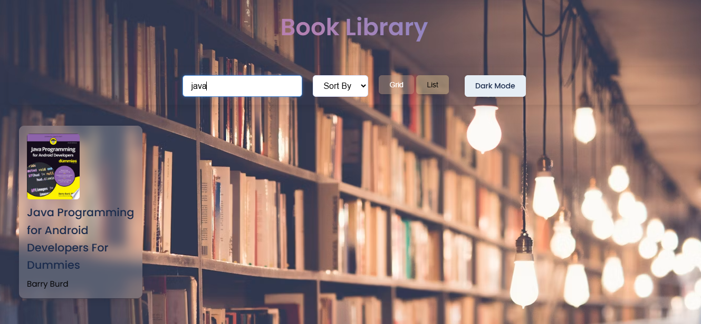

# 📚 Book Library

## 📖 About the Project
The **Book Library** is a simple web application that allows users to browse, search, sort, and navigate through a collection of books. Users can also toggle between grid and list views for better readability.

## 🚀 Features
- 🔍 **Search** books by title  
- 📅 **Sort** books by title or date  
- 📜 **Toggle View** (Grid/List mode)  
- ⏪ **Pagination** for easy navigation  
- 🎨 **Dark Mode Support** (optional)  

## 🌍 Live Demo  
👉 **[View Project Online](https://books-library-delta.vercel.app/)**  

## 🖼 Screenshots  
### 📌 Grid View  
  

### 🔍 List View 
  

### 📜 Search Functionality  
  

## 🛠️ Technologies Used
- **HTML** - Structure of the webpage  
- **CSS** - Styling and layout  
- **JavaScript** - Adds interactivity (search, sort, view toggle, pagination)  

##
